# 	异常问题

## 放射科执行基数药异常

核实是否生成执行记录：

```sql
SELECT * FROM OE_OrdExec a WHERE
a.OEORE OEORI ParRef= '58752369||39
```

没有则生成执行记录

```shell
GenExe^DHCOEOrdExec(rowid,SttDate)
```

Rowed:医嘱字表id

SttDate：如果是临时医嘱或者取药医嘱，取医嘱开立时间

```shell
#执行例子：
d  GenExe^DHCOEOrdExec("581969021||1224".$zdh("2022-07-27"3))
```

注意：生成了执行记录不会重复生成

## 卒中系统推送患者就诊信息

```shell
#入参就诊号：
w ##class(web.ZSSY.ApoplexyInterface).realReceiveRegister("50628013")
```


## 重推检查申请单

> 1.重推检查申请单（门诊走的是医嘱计费状态接口，住院走的是检查申请单信息(住院)接口）：

1.1住院推送检查申请单（OeoriList用“^”分割医嘱）

```shell
w ##class(web.DHCENS.EnsHISService).DHCHisInterface("SENDRISAPPBILLINFO","61680360||297")
```

1.2门诊推送检查申请单（OeoriList用“^”分割医嘱）

```shell
w ##class(web.DHCENS.EnsHISService).DHCHisInterface("SENDOPCHARGEINFO","61684641||11")
```

## 检验问题处理方式

处理步骤：

1. 查询到医嘱id之后先到消息总线查询消息日志，查看具体原因
2. 针对不同原因进行对应操作

> 未找到该医嘱信息，请先推送医嘱信息后再调用打印状态更新接口；

解决办法：

（1）重新查询；

（2）手工重新推送：入参是医嘱ID；

```shell
门诊：
W ##class(web.DHCENS.EnsHISService).DHCHisInterface("SENDOPCHARGEINFO","63743857||3^63743857||4")

住院：
W ##class(web.DHCENS.EnsHISService).DHCHisInterface("SENDDOCORDITEMINFO","61779808||55")
```

（3）停医嘱重开；

> 该条码[0493456216]已打印，请勿重复调用；

（1）先把重复的条码填到医嘱明细表的条码号字段，然后请科室撤销条码后重新滴管。语句如下：

```sql
SELECT OEORI_PlacerNo, * FROM OE_OrdItem WHERE OEORI_RowId='55035602||125' 
```


## 静配服务护士执行没有记录

```shell
w ##class(web.DHCENS.EnsHISService).DHCHisInterface("APPOINTMENTJP","89||6")
```

## 病理科病例无法提取

```shell
w ##class(DHCEWELL.DHCENS.TransDataToEwellFormat).cqPISGetAPPInfo("60851369||9")
```

## 检验打印条码推送

```shell
w ##class(Nur.NIS.Service.Base.OrderHandle).setExecPrintFlag("60520651||9||1","1234567","cqkfyd","P")
```

## 推送入院登记

```shell
w ##class(web.DHCENS.EnsHISService).DHCHisInterface("SENDADMINFO", 61880703)
```

## 推送出院登记

```shell
w ##class(web.DHCENS.EnsHISService).DHCHisInterface("SENDADMOUTINFO",60904259)
```

## 医嘱套嵌入医嘱套问题

```shell
医嘱录入框调用这块获取医嘱套内的医嘱明细返回^CacheTemp
```

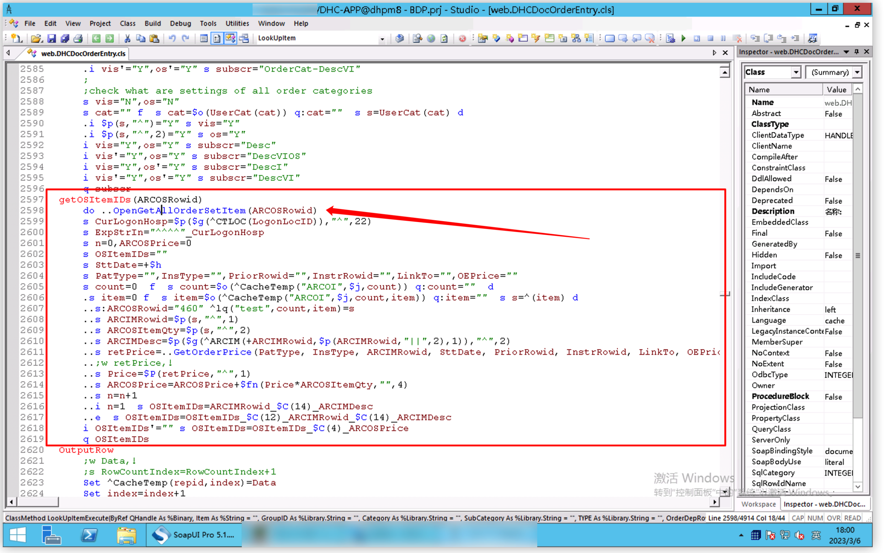

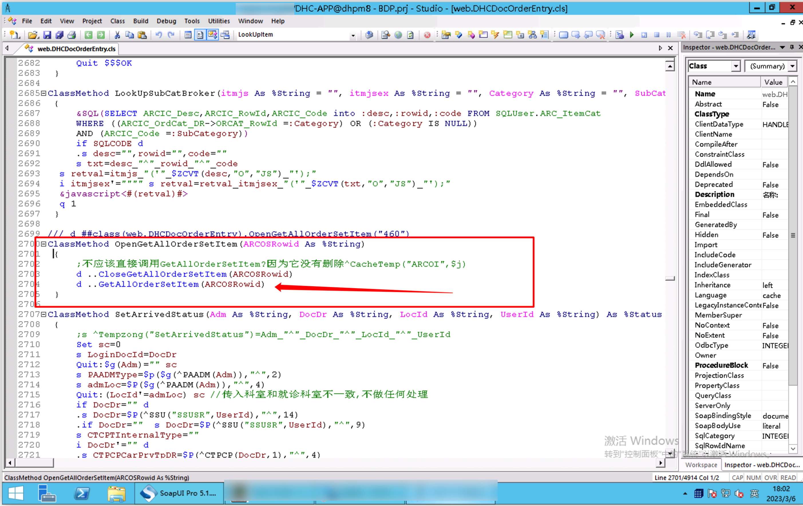

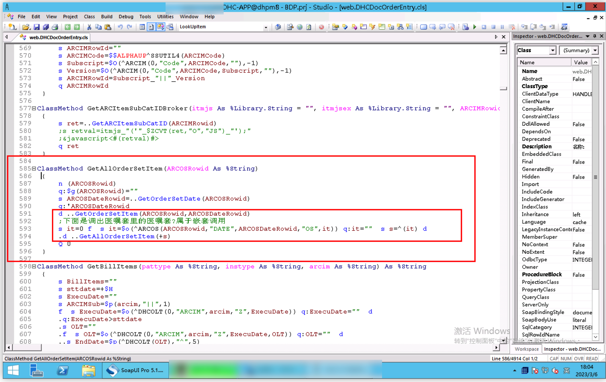

> 先是调用主医嘱套获取明细然后在这块递归调用取医嘱套里的明细项目时，医嘱套内的医嘱套将^CacheTemp里的主医嘱套内的明细项目节点给覆盖

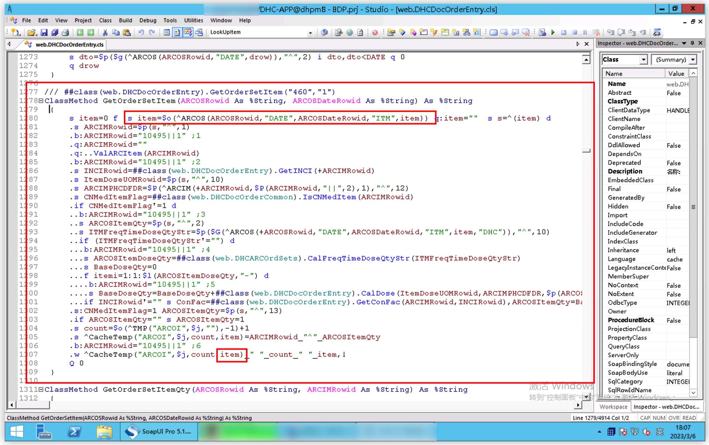

```shell
此item为医嘱套项目表rowid，目前这个无痛胃镜医嘱套里面的全身麻醉医嘱套第二次调用该方法时，由于是同一进程，则将无痛胃镜的前三个医嘱项目表rowid给覆盖（不清楚为什么重新建医嘱套后表里rowid则不会冲突）
```

> 无痛胃镜医嘱套表信息

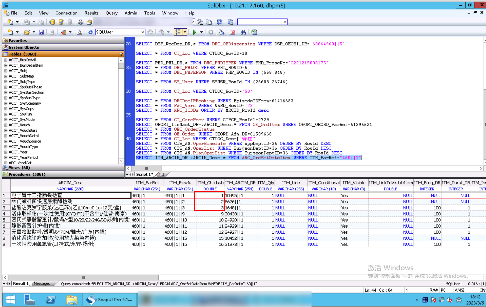

> 全身麻醉医嘱套表信息

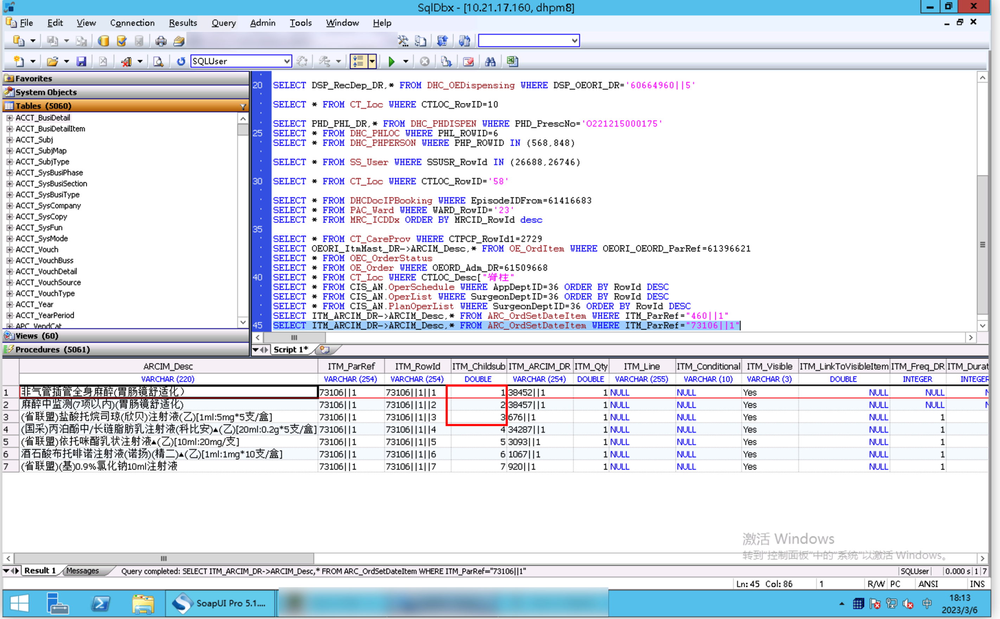

上述两个医嘱套项目明细里面的ITM_Childsub重复导致globle覆盖了

> 新建的测试医嘱套项目明细表不会这样，不清楚插表规则

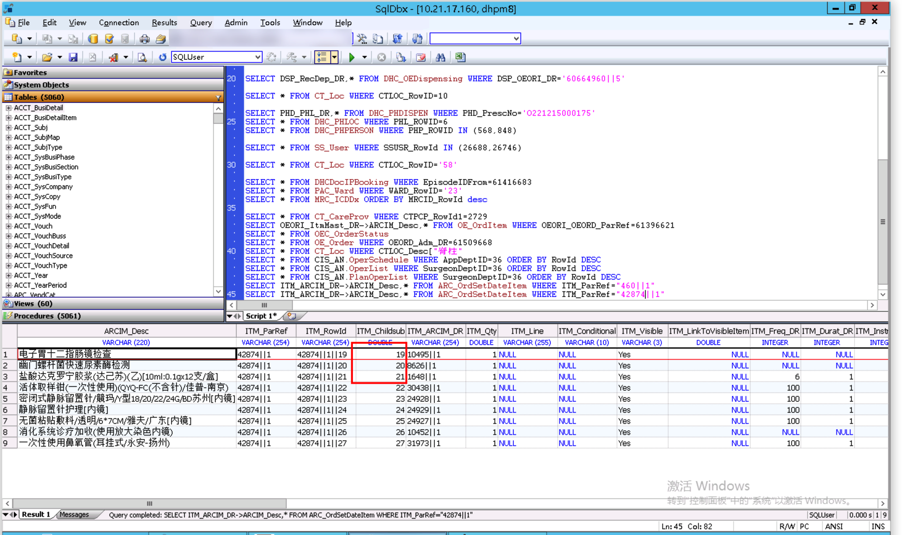

## 成组医嘱

1.自动带出成组的医嘱，比如检查带出造影剂

```sql
OEORI_ServiceOrd_DR：第一条医嘱

SELECT * FROM OE_OrdItemExt A WHERE A.OEORI_ServiceOrd_DR='50558824||440'
```

索引：

^OEORDi(0,"SERORD",{OEORI_ServiceOrd_DR},{OEORI_OEORD_ParRef},{OEORI_Childsub})

2.手工关联的成组的医嘱，比如药品关联溶

```sql
DHCORI_OEORI_Dr：主医嘱
SELECT * FROM DHC_OE_OrdItem A WHERE A.DHCORI_OEORI_Dr
```

索引：

^OEORDi(0,"OEORI",{OE_Order.OEORD_RowId},{OEORI_OEORI_DR},{OEORI_Childsub})

# 药房

## 基数药补货问题

DHC_BaseDrugDispItm：补货子表 当补货单的状态是“未完成时”

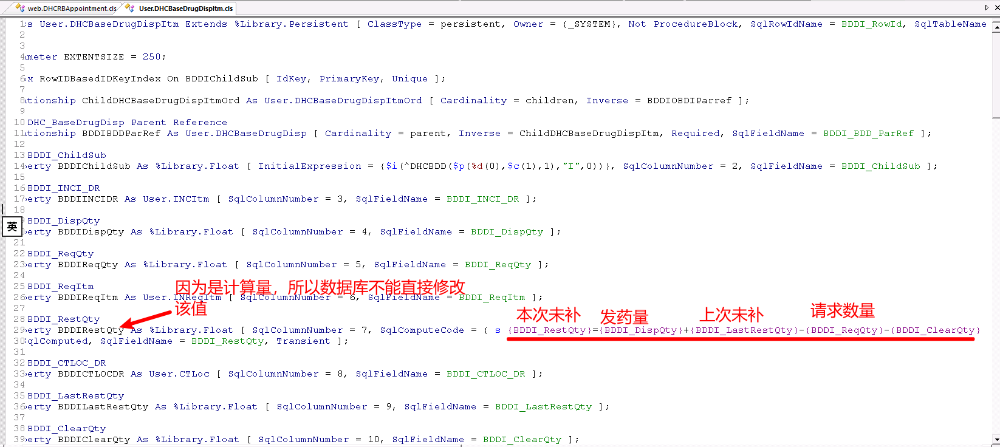


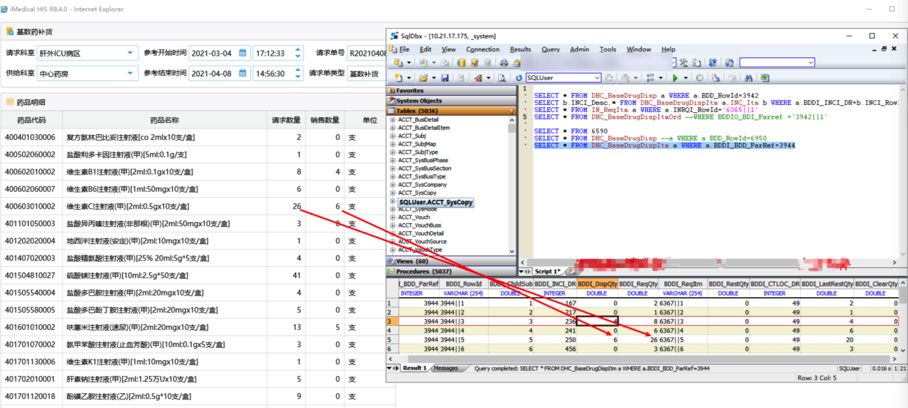

当补货单的状态是“已完成等待出库时”或者“已接收”时

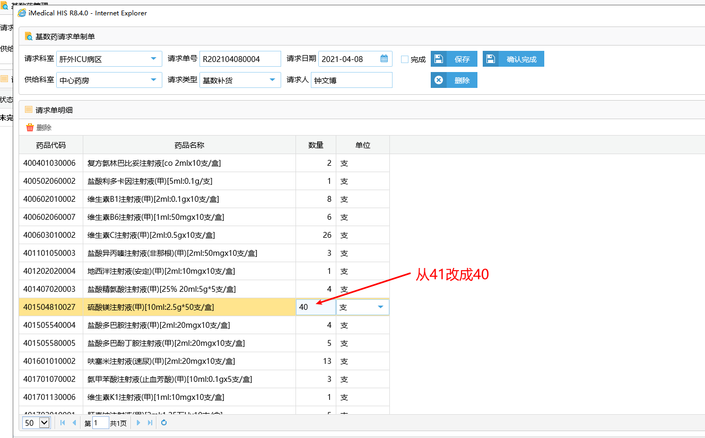

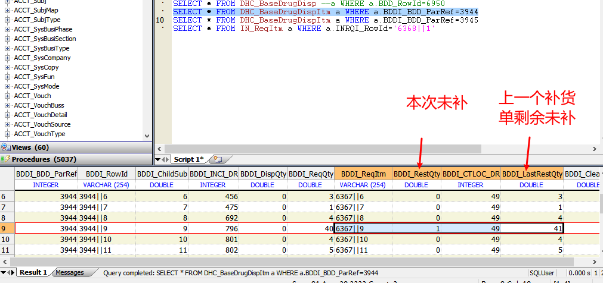

下一个补货单：

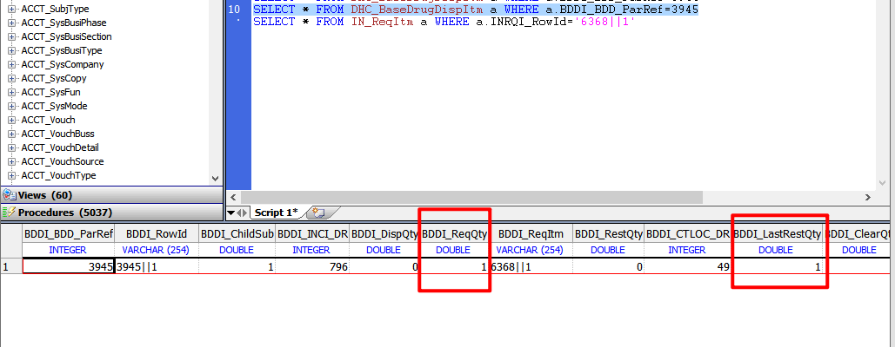

```sql
公式：本次未补=上次未补+发药量-请求数量

​           本次未补=下一行的上次未补

SELECT a.BDDI_RestQty 本次未补,a.BDDI_LastRestQty 上次未补,a.BDDI_DispQty 发药量,a.BDDI_ReqQty 请求数量,* 

FROM DHC_BaseDrugDispItm a WHERE a.BDDI_CTLOC_DR=99 AND a.BDDI_INCI_DR=903

SELECT * FROM INC_Itm a WHERE a.INCI_Code='401801020005'

SELECT * FROM CT_Loc  a WHERE a.CTLOC_Desc["血管外科"
```

## 基数药执行发药

> 住院发药

```shell
w ##class(PHA.FACE.OUT.Method).SaveINDispData("62583043||77||1",25655) 
//第二个参数：SS_User ID
```

> 门诊发药

```shell
w ##class(PHA.FACE.OUT.Method).SaveOutDispData("62583043||77","25655","711")
第二个参数：SS_User Code
第三个参数：药房CT_Loc ID
```

## 药房相关接口

#### **推住院颗粒处方信息**

```shell
消息代码：MES0164；
代码调用：
w ##class(web.DHCENS.BLL.Drug.Method.OPMachine).SendOrderToMechine(14499592)
入参：住院发药(DHC_PHACollected)表rowid；
```

#### **推门诊颗粒处方信息**

```shell
消息代码：MES0163；
代码调用：
w ##class(web.DHCENS.EnsHISService).DHCHisInterface("SendOpDrugInfo","O230322009610")//在院内总线门诊处方信息推送查看

萝岗
w ##class(web.DHCENS.EnsHISService).DHCHisInterface("SendOpDrugInfoLG","O230322013584")
```

#### 萝岗报到机接口

```shell
消息代码：MES0085；
代码调用：
w ##class(web.DHCSTInterfacePH).RegisterLG("")；
服务地址：

```

####  萝岗配药完成接口

```shell
消息代码：MES0077；
代码调用：
W ##class(web.DHCSTInterfacePH).SetPYSureFromRC("")
服务地址：

```

#### 萝岗上屏接口

```shell
消息代码：MES0077；
代码调用：
W ##class(web.DHCSTInterfacePH).SetPYSureFromRC("")
服务地址：

```

#### 住院包药机传处方接口

```shell
消息代码：MES0071；
代码调用：
w ##class(web.DHCENS.BLL.Drug.Method.OPMachine).SendOrderToIPMechine(26)
服务地址：

```

#### 静配门诊/住院发药接口

```shell
W ##class(PHA.FACE.OUT.Method).InsertDispData("<Request><Header><SourceSystem>111</SourceSystem><MessageID>1</MessageID></Header><Body><OutOrInDisp>O</OutOrInDisp><DispOrders>50330498||12||1^50330498||11||1</DispOrders><UserCode>P16330</UserCode></Body></Request>")
```

#### 出院带药上屏Query

```shell
/// Debug: d ##class(%ResultSet).RunQuery("PHA.IP.DispCheck.Query","PHACollectedOutPat")
/// pCheckType : Confirm - 配药确认，Collect - 发药确认
/// pTypeId： 0 - 未确认,	1 - 已确认
/// 已配药未配药确认:d ##class(%ResultSet).RunQuery("PHA.IP.DispCheck.Query","PHACollectedOutPat",,"Confirm")
/// 已配药确认未发药确认:d ##class(%ResultSet).RunQuery("PHA.IP.DispCheck.Query","PHACollectedOutPat")
/// 					或者:d ##class(%ResultSet).RunQuery("PHA.IP.DispCheck.Query","PHACollectedOutPat",,"Confirm",,,,,,,,1)
/// 已发药确认:d ##class(%ResultSet).RunQuery("PHA.IP.DispCheck.Query","PHACollectedOutPat",,,,,,,,,,1)
```

#### 出院带药上屏程序

```shell
/// 入参：药房ID，窗口ID
/// d ##class(%ResultSet).RunQuery("PHA.OP.PyDisp.Query","WaitPatList","7","8","","29/12/2019","29/12/2019")
/// w ##class(web.DHCVISVoiceCall).GetDurgWaitPatZXYF()
ClassMethod GetDurgWaitPatZXYF() As %String
{
	
	s FYflag=""
	s Index=+$h
	s showMax=10
	s startDate=$zd(Index,3)
	s endDate=$zd(Index,3)
	s num=0
	s lastone=""
	s CPmiNo="",CPerName="",CPrtInv="",inci="",CPydr="",CFydr="",CDepCode="",CDoctor="",retstr="",PatName=""
	Set rs=##Class(%ResultSet).%New("PHA.IP.DispCheck.Query:PHACollectedOutPat")
	If rs.QueryIsValid() {
		Set Status=rs.Execute(,,,,,,,,,1)
		Set columns = rs.GetColumnCount()
		If 'Status Quit
		While rs.Next() {
			s PatName=rs.GetData(1)
			s PatName=..PrivateName(PatName)
			i $L(PatName)>4 s PatName=$E(PatName,1,4)
			i $L(PatName)=2 s PatName=PatName_"    "
			i $L(PatName)=3 s PatName=PatName_"  "
			i retstr="" s retstr=PatName
			e  s retstr=retstr_PatName
		}
		}
	q retstr
}
```


### 获取慢病用药标识（医嘱项）

```shell
/// Description:通过医嘱项ID获取慢病用药标志
/// Creator:    xiexiangmin
/// CreateDate: 2023-05-10
/// Table:      
/// Input:      ArcimDr-医嘱项ID
/// Output:     Y:是   N:否
/// Others:     
/// w ##class(PHA.FACE.OUT.Com).GetChronicMedFlag("15")
```


# HIS公共方法

## HIS发送短信方法

```shell
w ##class(web.DHCENS.EnsHISService).DHCHisInterface("S00000056","13662335918","测试短信")
```

## 获取入院日期

```shell
w ##class(EMRservice.HISInterface.PatientInfoAssist).GetAdmDate(EpisodeID)
```

## 获取所有诊断

```shell
w ##class(web.DHCDocDiagnosNew).GetMRDiagnosToEMR(EpisodeID)
```

## 药房转换为指定单位的数量

```shell
##class(PHA.COM.Method).BQtyToPhaUomQty(incId,qty,dispUomId)
```

## 基本转换为门诊发药单位数量

```shell
##class(PHA.COM.Method).BQtyToOutUomQty(incId,qty)
```

## 取医嘱用法

```shell
##class(PHA.COM.Order).OeoriInstruc(oeori)
```

## 取开单医生

```shell
##class(PHA.COM.Order).OeoriDoctor(oeori)
```

## 转化时间公共方法

```shell
##class(PHA.FACE.IN.Com).DateLogicalToHtml(phddate)
```

## 就诊号判断是否是急诊留观

```shell
w ##class(web.UDHCJFBaseCommon).GetPatAdmStayStat(admId)
```


# 改表备份

## 病区护士补货修改了单位问题处理

```sql
SELECT a.BDDI_RestQty 本次未补,a.BDDI_LastRestQty 上次未补,a.BDDI_DispQty 发药量,a.BDDI_ReqQty 请求数量,* FROM DHC_BaseDrugDispItm a WHERE a.BDDI_CTLOC_DR=37 AND a.BDDI_INCI_DR=5893
```


> **基数药子表**(原数据)

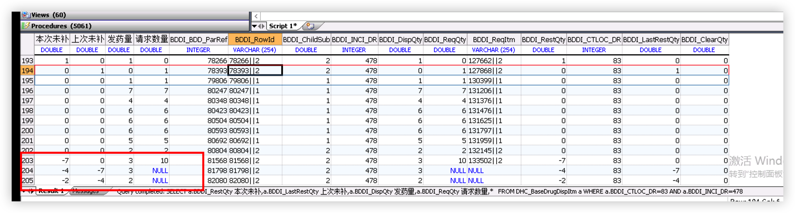

> **基数药子表**（修正后）

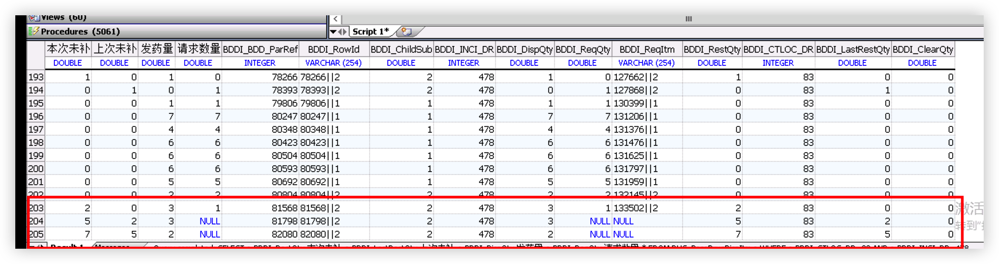

> 库存请求子表(原数据)

```sql
select * from IN_ReqItem where INRQI_RowId='133502||2'
```


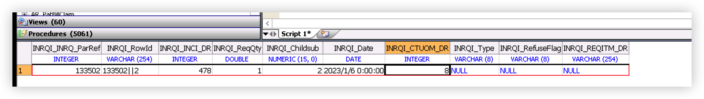

> 库存请求子表（修正后）

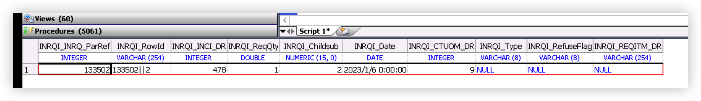

> 库存转移表子表（原数据）

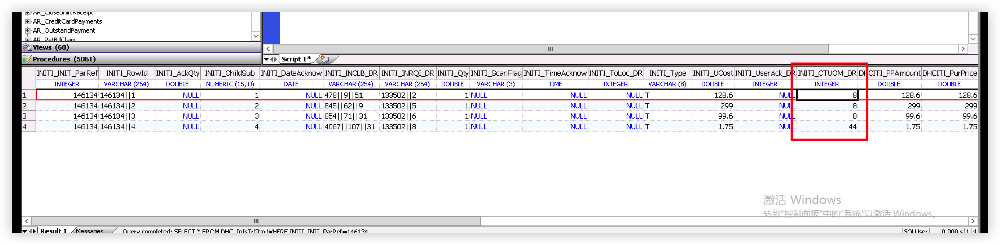

> 库存转移子表（修改后）

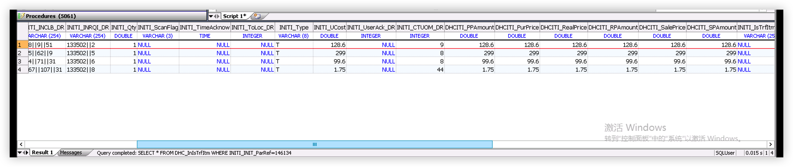

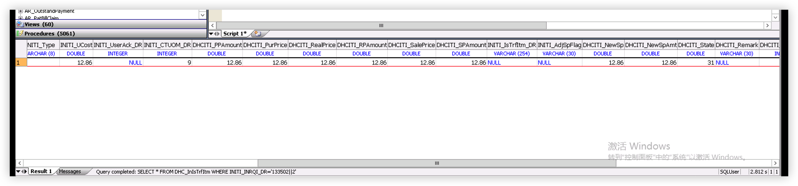

> 台账表（原始数据）


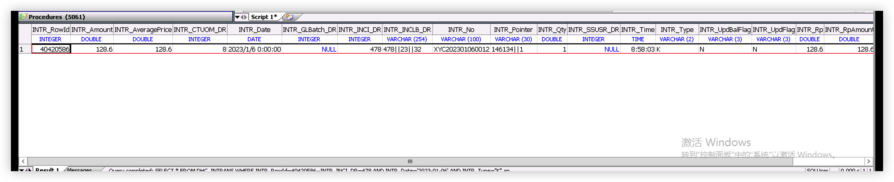

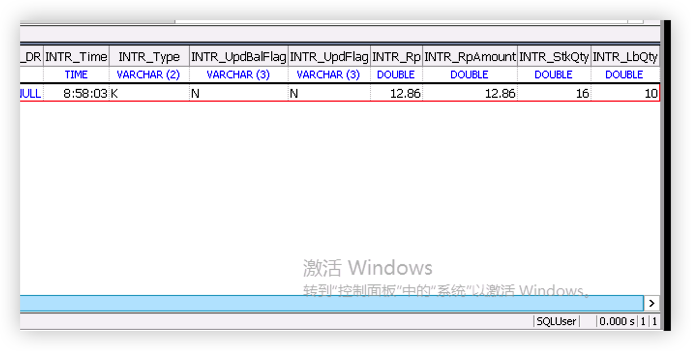

> 台账表（修改后）

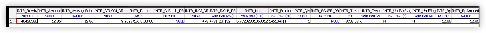

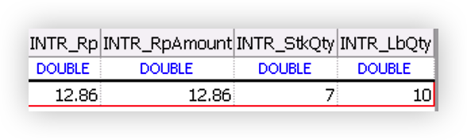

## 医嘱套价格问题改表备份

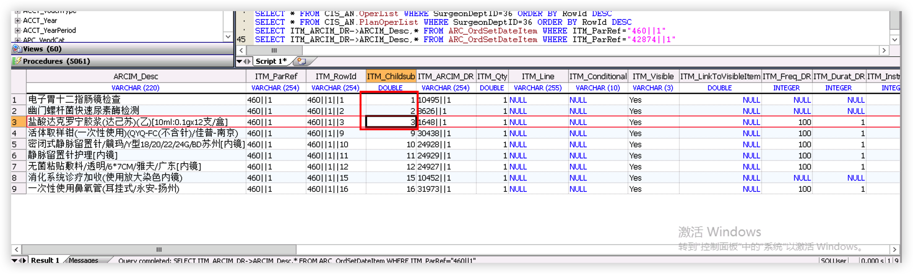

# 互联网医院接口

## 1.1.1 插入住院证

|            |                  |
| ---------- | ---------------- |
| 接口方式   | XML+WebService   |
| 服务编码   | MES0354          |
| 服务名称   | 第三方插入住院证 |
| 服务提供者 | 平台             |

 

**请求消息：** 

| ***\*代码\****   | ***\*名称\**** | ***\*数据类型\**** | ***\*是否必输\**** | ***\*备注\****                                   |
| ---------------- | -------------- | ------------------ | ------------------ | ------------------------------------------------ |
| BookID           | 住院证ID       |                    |                    |                                                  |
| PatNo            | 患者登记号     |                    | NOT NULL           |                                                  |
| PAAdmOP          | 当次门诊就诊号 |                    | NOT NULL           |                                                  |
| PAAdmIP          | 当次住院就诊号 |                    |                    |                                                  |
| CreateDate       | 创建日期       |                    |                    |                                                  |
| CreateTime       | 创建时间       |                    |                    |                                                  |
| CreaterUser      | 创建人工号     |                    | NOT NULL           |                                                  |
| CreaterDoc       | 创建医生工号   |                    | NOT NULL           |                                                  |
| InCurStatu       | 住院证状态     |                    | NOT NULL           | 申请：8撤销：15预住院：17                        |
| BookActive       | 有效状态       |                    | NOT NULL           | Y/N                                              |
| InSdate          | 预约日期       |                    | NOT NULL           | YYYY-MM-DD                                       |
| InWard           | 病区描述       |                    | NOT NULL           |                                                  |
| InBed            | 床位ID         |                    |                    |                                                  |
| InCtloc          | 科室描述       |                    | NOT NULL           |                                                  |
| ICDCode          | 诊断代码       |                    |                    |                                                  |
| InResumeText     | 备注           |                    |                    |                                                  |
| Text             | 备注2          |                    |                    |                                                  |
| IPDeposit        | 住院押金       |                    | NOT NULL           |                                                  |
| MRCCondtion      | 入院病情       |                    |                    |                                                  |
| AdmInitState     | 入院病情（新） |                    |                    |                                                  |
| InReason         | 操作原因ID     |                    | NOT NULL           | 办理住院：13                                     |
| InSorce          | 入院途径ID     |                    | NOT NULL           | 门诊：9急诊：10其他医疗机构转入：11其他：12      |
| InBedType        | 建议床位       |                    |                    | 普通床位：37单间：38特护床位：39                 |
| ICDList          | 诊断           |                    | NOT NULL           | 例：60447\|\|1!53590\|\|1(多个诊断用感叹号!分隔) |
| CTLocMedUnit     | 医疗单元       |                    |                    |                                                  |
| InDoctor         | 主治医师工号   |                    | NOT NULL           |                                                  |
| PatientLevel     | 患者等级       |                    |                    |                                                  |
| TreatedPrinciple | 收治原则       |                    |                    |                                                  |
| IsDayFlag        | 是否日间手术   |                    |                    | Y/N                                              |
| IsOutTriage      | 是否外院转来   |                    |                    | Y/N                                              |
| WardFlag         | 病区类型       |                    |                    | 本科室：1  本科室关联：2  其他病区：3            |
| LocLogOn         | 建证科室描述   |                    | NOT NULL           |                                                  |
| ApoplexyFlag     | 卒中标志       |                    |                    | Y/N                                              |
| CreateDocPhone   | 建证医生电话   |                    | NOT NULL           |                                                  |
| SubmitFlag       | 是否服从分配   |                    | NOT NULL           | Y/N                                              |

> 示例

 ```xml
 <Request>
     <BookID></BookID>
     <PatID>0000579325</PatID>
     <PAAdmOP>50629584</PAAdmOP>
     <PAAdmIP></PAAdmIP>
     <CreateDate></CreateDate>
     <CreateTime></CreateTime>
     <CreaterUser>doctor</CreaterUser>
     <CreaterDocIDUser>doctor</CreaterDocIDUser>
     <InCurStatu>8</InCurStatu>
     <BookActive>Y</BookActive>
     <InSdate>2023-02-05</InSdate>
     <InWard>心血管内科病区</InWard>
     <InBed></InBed>
     <InCtloc>心血管内科</InCtloc>
     <ICDCode></ICDCode>
     <InResumeText></InResumeText>
     <Text></Text>
     <IPDeposit>10</IPDeposit>
     <MRCCondtion></MRCCondtion>
     <AdmInitState></AdmInitState>
     <InReason>13</InReason>
     <InSorce>9</InSorce>
     <InBedType>37</InBedType>
     <ICDList>10650||1</ICDList>
     <CTLocMedUnit></CTLocMedUnit>
     <InDoctor>7654321</InDoctor>
     <PatientLevel></PatientLevel>
     <TreatedPrinciple></TreatedPrinciple>
     <IsDayFlag></IsDayFlag>
     <IsOutTriage></IsOutTriage>
     <WardFlag>1</WardFlag>
     <LocLogOn>心血管内科门诊</LocLogOn>
     <ApoplexyFlag></ApoplexyFlag>
     <CreateDocPhone>1234567</CreateDocPhone>
     <SubmitFlag>N</SubmitFlag>
 </Request>
 ```


应答消息：

| ***\*代码\**** | ***\*名称\**** | ***\*数据类型\**** | ***\*是否必输\**** | ***\*备注\****  |
| -------------- | -------------- | ------------------ | ------------------ | --------------- |
| SourceSystem   | 消息来源       | VARCHAR(50)        | NOT NULL           |                 |
| MessageID      | 消息ID         | VARCHAR(30)        | NOT NULL           |                 |
| ResultCode     | 响应码         | VARCHAR(6)         | NOT NULL           | 0：成功 -1:失败 |
| ResultMsg      | 响应信息       | VARCHAR(300)       | NOT NULL           |                 |

```xml
<Response>
    <ResultCode>0</ResultCode>
    <ResultMsg>成功^13732</ResultMsg>
</Response>
```

 

# 基础平台

## 危急值发送消息至公众号

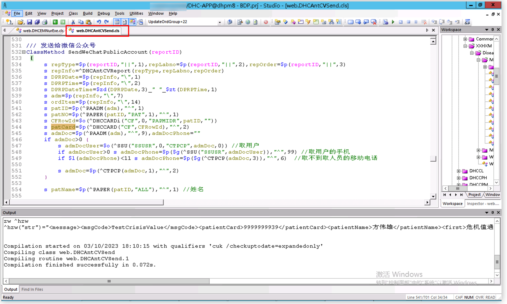

```shell
/// 发送给微信公众号
ClassMethod SendWeChatPublicAccount(reportID)
{
	s repType=$p(reportID,"||",1),repLabno=$p(reportID,"||",2),repOrder=$p(reportID,"||",3)
	s repInfo=^DHCAntCVReport(repType,repLabno,repOrder)
	s DPRPDate=$p(repInfo,"\",1)
	s DPRPTime=$p(repInfo,"\",2)
	s DPRPDateTime=$zd(DPRPDate,3)_" "_$zt(DPRPTime,1)
	s adm=$p(repInfo,"\",7)
	s ordItem=$p(repInfo,"\",14)
	s patID=$p(^PAADM(adm),"^",1)
	s patNO=$p(^PAPER(patID,"PAT",1),"^",1)
	s CFRowId=$o(^DHCCARDi("CF",0,"PAPMIDR",patID,""))
	s patCard=$p(^DHCCARD("CF",CFRowId),"^",2)
	s admDoc=$p(^PAADM(adm),"^",9),admDocPhone=""
	if admDoc>0 {
		s admDocUser=$o(^SSU("SSUSR",0,"CTPCP",admDoc,0)) //取用户
		if admDocUser>0 s admDocPhone=$p($g(^SSU("SSUSR",admDocUser)),"^",99) //取用户的手机
		if $l(admDocPhone)<11 s admDocPhone=$p($g(^CTPCP(admDoc,3)),"^",6)  //取不到取人员的移动电话
		
		s admDoc=$p(^CTPCP(admDoc,1),"^",2)
	}
	
	s patName=$p(^PAPER(patID,"ALL"),"^",1) //姓名
	
	s sex=$p(^PAPER(patID,"ALL"),"^",7)
	i sex>0 s sex=$p(^CT("SEX",sex),"^",2)
	
	s age=##class(web.DHCBillInterface).GetPapmiAge(patID,adm)
	
	s idCard=$p($G(^PAPER(patID,"ALL")),"^",9)
	
	s patPhone=##class(Nur.CommonInterface.Patient).getTelphone(adm)
	
	s ordDesc=##class(web.DHCAntCVReportSearch).GetOrdItems(ordItem)
	
	s repResult=$g(^DHCAntCVReport(repType,repLabno,repOrder,"Result"))
	if repType=1 s repResult=##class(web.DHCAntCVReceive).GetCVReportResultOfRis(repType,repLabno_"||"_repOrder)
	
	s ordRecLoc=$p($g(^OEORD(+ordItem,"I",+$p(ordItem,"||",2),3)),"^",6),repLoc=""
	i ordRecLoc>0 s repLoc=$p($g(^CTLOC(ordRecLoc)),"^",2)
	
	s repUser=$p(repInfo,"\",3)
	i repUser>0,$d(^SSU("SSUSR",repUser)) s repUser=$p(^SSU("SSUSR",repUser),"^",2)
	s title="危机值通知",note="您的"_ordDesc_"报告中有危急值结果。请您来院咨询医师进行诊疗。"
	s str="<message><msgCode>TestCrisisValue</msgCode><patientCard>"_patCard_"</patientCard><patientName>"_patName_"</patientName><first>"_title_"</first><memo>"_note_"</memo></message>"
	//s ^hzw("str")=str
	s ret=##class(iH.Api.PublicMessage).SendMessage(str)
	q ret
}
```

## 消息平台

### 1. 发送消息接口

```shell
w ##class(websys.DHCMessageInterface).Send("测试", "1002", "30099", "", "", "23469", "", "", "" , "")
```

| *参数名*       | *说明*            | *备注*                                                       |
| -------------- | ----------------- | ------------------------------------------------------------ |
| Context        | 发送的消息内容    | 可以为空，系统会根据就诊与医嘱id生成内容                     |
| ActionTypeCode | 消息动作代码      | 如1002表示处方点评。具体值见[动作类型](https://hisui.cn/bsp/message/#消息动作类型) |
| FromUserRowId  | 发送消息的用户Id  | 如果获取不到HIS用户Id, 可以传入”^姓名”                       |
| EpisodeId      | 病人就诊Id        | 如获取不到可以为空。                                         |
| OrdItemId      | 医嘱Id            | 如获取不到可以为空                                           |
| ToUserRowId    | 接收消息的用户Id  | 多个以^分隔，可以为空 (SS_User.SSUSR_RowId)                  |
| OtherInfoJson  | 其它信息          | 可以为空。格式为json `"link":"xx.csp",linkParam:"EpisodeId=1&ReportId=002"`, `"dialogWidth":1000,"dialogHeight":500,` `"target":"_blank","BizObjId":1` ，其中属性均为可选项 具体值见[OtherInfoJson说明](https://hisui.cn/bsp/message/#otherinfojson说明) |
| ToLocRowId     | 接收消息的科室 Id | 可以为空。 格式”LocId1^LocId2^LocId3\|其它标记”  “1^2^3” 发给科室1、2、3所有医护人员 “1^2^3\|ToNurse”发给科室1、2、3所有护士 “1^2^3\|ToDoctor”发给科室1、2、3所有医生 “1^2^3\|Logon”发给有此科室1或2或3登录权限的所有用户(HIS8.4) “1^2^3\|OnlyFlag”仅作一个标识告诉我们这个消息 是想发给哪个科室的人的， 具体哪些人还需要在前面ToUserRowId参数传 此参数主要是为了解决一个发给A科的所有人的消息（比 如会诊）， 但是某人拥有AB两科的权限，在登录B科时 不查看 A科消息 |
| EffectiveDays  | 消息有效天数      | 可以为空。此有效天数级别高于动作类型所配置                   |
| CreateLoc      | 发送者科室        | 可以为空。传HIS中科室Id，可传“＾科室描述”                    |

| *返回值*      | *说明*   | *备注*                 |
| ------------- | -------- | ---------------------- |
| 大于0         | 成功     |                        |
| -100^ErrorMsg | 表示失败 | 如:-100^动作类型不存在 |

*** 消息实际接收人由`消息类型接收对象配置`、`消息类型高级接收对象配置`、`消息类型抄送人配置`、`ToUserRowId参数`、`ToLocRowId参数`共同决定，取并集 ***

*** 如果需要按照安全组等其它方式指定接收者，见[其它发送接口](https://hisui.cn/bsp/message/OtherSend) ***

##### 消息动作类型

| 消息类型                                                   | 代码 | 入参      | 接受对象       | 备注                                        |
| ---------------------------------------------------------- | ---- | --------- | -------------- | ------------------------------------------- |
| 通知                                                       | 2000 |           |                | 发送通知用                                  |
| OA通知                                                     | 2001 |           |                | OA通知，用户传代码，程序单独转成用户ID      |
| 危急值                                                     | 1000 | EpisodeID | 危急值平台配置 | 危急值平台通讯，响应对象的接口 `危急值平台` |
| 感染                                                       | 1001 | EpisodeID | 主管医生       | `医政`                                      |
| [查看更新类型](https://hisui.cn/bsp/message/MSGActionType) |      |           |                |                                             |

*** 消息动作类型尽可能保证在不同项目中对同一业务使用相同消息类型，避免消息类型的误用 ***

##### OtherInfoJson说明

| *键*         | *示例值*                                         | *说明*                                                       |
| ------------ | ------------------------------------------------ | ------------------------------------------------------------ |
| linkParam    | EpisodeId=1&ReportId=002                         | 链接参数，与动作类型配置的Link合成URL，便于修改csp路径。 如: 把危机值1000类型对应的处理链接维护为criticalvalue.trans.csp则消息明细对应的处理URL为criticalvalue.trans.csp?EpisodeId=1&ReportId=002 |
| link         | criticalvalue.trans.csp?EpisodeId=1&ReportId=002 | 业务处理或查看明细URL，级别高过动作类型配置的link            |
| dialogWidth  | 1000 默认1000                                    | 打开处理界面时界面宽度。界面宽度为1000px 支持百分比表示占顶层宽度的百分比如80%(`HIS8.3`以后) |
| dialogHeight | 500 默认 500                                     | 打开处理界面时界面高度。界面高度为500px支持百分比表示占顶层宽度的百分比如50%(`HIS8.3`以后) |
| target       | 默认空                                           | 目标窗口 如果为_blank 采用window.open新窗口方式打开，否则为顶层界面弹出hisui(easyui)模态框，内嵌iframe形式打开 |
| BizObjId     | 1                                                | 业务系统ID，用于后续消息处理、撤销定位消息                   |

### 2. 消息处理

#### 2.1 消息处理接口ExecAll

用于已知消息明细记录ID（1.发送时记录下来，2.在消息处打开的处理界面会传入明细记录ID），来处理消息

```
w ##class(websys.DHCMessageInterface).ExecAll(MsgDetailsId, ExecUserDr, ExecDate, ExecTime)
```

| *参数名*     | *说明*         | *备注*                                                       |
| ------------ | -------------- | ------------------------------------------------------------ |
| MsgDetailsId | 消息明细记录ID | 不可为空. 点击【处理】按钮弹出的界面可以通过%request.Data(“MsgDetailsId”,1)拿到消息Id |
| ExecUserDr   | 处理用户ID     | 默认当前会话用户. %session.Data(“LOGON.USERID”)              |
| ExecDate     | 处理日期       | 默认当前日期. +$h                                            |
| ExecTime     | 处理时间       | 默认当前日期. $p($h, “,”2)                                   |

| *返回值*      | *说明*                 | *备注* |
| ------------- | ---------------------- | ------ |
| 大于0         | 成功                   |        |
| -102          | 消息已执行过           |        |
| -103          | 消息内容Id为空         |        |
| -104          | 执行人为空             |        |
| -105          | 消息明细Id不在明细表中 |        |
| -106          | 消息明细Id不能为空     |        |
| -108^ErrorMsg | 其它错误               |        |

示例

```
 <Server>
	 //从%request内拿消息明细id
	 Set DetailsId = $g(%request.Data("MsgDetailsId",1))
 </Server>
 <script type="text/javascript">
	var DetailsId = "#(DetailsId)#";
	// 关闭消息弹出窗口方法
	function closewin(){
		window.close();
		top.HideExecMsgWin();
	}
	/// 执行所有相关消息
	function SendExec(){
		tkMakeServerCall("websys.DHCMessageInterface","ExecAll",DetailsId) 
	}
 </script>
```

#### 2.2 消息处理接口Exec

用于相应业务处理完成后，将消息置为已处理，此方法为根据业务数据(消息类型、就诊、医嘱、业务ID)去查找消息数据，将查到的最新一条消息置为已处理。注意要避免同一业务数据发送多条消息。

```
w ##class(websys.DHCMessageInterface).Exec(ToUserId, ActionType, EpisodeId, OEOrdItemId, ObjectId, ExecUserDr, ExecDate, ExecTime,OtherParams)
```

| *参数名*    | *说明*       | *备注*                                                       |
| ----------- | ------------ | ------------------------------------------------------------ |
| ToUserId    | 用户ID       | 为空处理所有人消息，不为空只处理此人消息                     |
| ActionType  | 消息类型代码 | 发送消息时传的动作代码                                       |
| EpisodeId   | 病人就诊ID   | 发送消息时传的EpisodeId                                      |
| OEOrdItemId | 医嘱ID       | 发送消息时传的OEOrdItemId                                    |
| ObjectId    | 业务ID       | 如果发送消息的OtherInfoJson有BizObjId属性,请传BizObjId属性值; 如果没有建议传OtherInfoJson的部分值用于确定哪条消息； 如果根据就诊或医嘱已经能唯一确定消息可以传空 |
| ExecUserDr  | 处理用户ID   | 默认当前会话用户. %session.Data(“LOGON.USERID”)              |
| ExecDate    | 处理日期     | 默认当前日期. +$h                                            |
| ExecTime    | 处理时间     | 默认当前日期. $p($h, “,”2)                                   |
| OtherParams | 其它扩展参数 | 用于后续参数扩展，扩展多个用^分隔 默认空 注意此参数在8.4之后才有 |

| *返回值*      | *说明*         | *备注* |
| ------------- | -------------- | ------ |
| 大于0         | 成功           |        |
| -3            | 未找到消息     |        |
| -102          | 消息已执行过   |        |
| -103          | 消息内容Id为空 |        |
| -107          | 执行人为空     |        |
| -108^ErrorMsg | 其它错误       |        |

##### OtherParams以^分隔每个位置说明

| *按^分隔位置* | *说明*                   | *备注*                                                       |
| ------------- | ------------------------ | ------------------------------------------------------------ |
| 1             | 只处理哪个人员类型的消息 | 为空处理所有`(CT_CarPrvTp.CTCPT_InternalType)[NURSE,DOCTOR,Technician,Pharmacist,Other]` |
| 2             | 审核拒绝标志(Y/N)        | 医呼通 需要审核通过或拒绝标志 Y通过接受 N拒绝驳回            |
| 3             | 审核备注拒绝原因         | 审核备注拒绝原因                                             |

示例

```
<script type="text/javascript">
        // 关闭消息弹出窗口方法
        function closewin(){
                window.close();
                top.HideExecMsgWin();
	}
        /// 执行所有相关消息
        function SendExec(){
                //tkMakeServerCall("websys.DHCMessageInterface","Exec","","1000","","","PrescNO=102")		  
                tkMakeServerCall("websys.DHCMessageInterface","Exec","","1000","55","55||1","ReportId=102&RepType=1")
        }
</script>
```

#### 2.3 消息撤销接口Cancel

用于撤销已发送的消息
撤销判断逻辑：读即处理消息，有一人读过则不可撤销，其它有一人处理过则不可撤销

```
w ##class(websys.DHCMessageInterface).Cancel(ToUserId, ActionType, EpisodeId, OEOrdItemId, ObjectId, ExecUserDr, ExecDate, ExecTime)
```

| *参数名*    | *说明*       | *备注*                                                       |
| ----------- | ------------ | ------------------------------------------------------------ |
| ToUserId    | 用户ID       | 无用参数（为方便，此方法参数设计和Exec一致）                 |
| ActionType  | 消息类型代码 | 发送消息时传的动作代码                                       |
| EpisodeId   | 病人就诊ID   | 发送消息时传的EpisodeId                                      |
| OEOrdItemId | 医嘱ID       | 发送消息时传的OEOrdItemId                                    |
| ObjectId    | 业务ID       | 如果发送消息的OtherInfoJson有BizObjId属性,请传BizObjId属性值; 如果没有建议传OtherInfoJson的部分值用于确定哪条消息； 如果根据就诊或医嘱已经能唯一确定消息可以传空 |
| ExecUserDr  | 处理用户ID   | 默认当前会话用户. %session.Data(“LOGON.USERID”)              |
| ExecDate    | 处理日期     | 默认当前日期. +$h                                            |
| ExecTime    | 处理时间     | 默认当前日期. $p($h, “,”2)                                   |

| *返回值*      | *说明*           | *备注*         |
| ------------- | ---------------- | -------------- |
| 数字          | 大于0表示成功    |                |
| 0             | 消息状态不可撤回 |                |
| -2            | 消息状态不可撤回 |                |
| -3            | 未找到消息       |                |
| -107          | 撤销人为空       |                |
| -100^ErrorMsg | 表示失败         | 如:-100^ID错误 |

### 3. 配置说明

#### 3.1 接收对象

预定义的常见的接收对象，一般和就诊、医嘱相关

| *代码*             | *名称*             | *备注*                                                       |
| ------------------ | ------------------ | ------------------------------------------------------------ |
| AdmDoctor          | 主管医生           | 患者就诊的主管医生或接诊医生                                 |
| AdmDoctorMedUnit   | 主管医生医疗单元   | 患者就诊主管医生所属的医疗单元                               |
| OrderDoctor        | 下医嘱医生         | 下医嘱医生                                                   |
| OrderDoctorMedUnit | 下医嘱医生医疗单元 | 下医嘱医生医疗单元                                           |
| AdmLoc             | 就诊科室           | 患者就诊科室所关联的医护人员                                 |
| WardDoctor         | 科室医生           | 患者就诊科室所关联的医生                                     |
| WardNurse          | 病区护士           | 患者所在病区关联的护士                                       |
| WardDoctorNurse    | 科室医生与病区护士 | 患者就诊科室和所在病区所关联的医护人员                       |
| OAUserCode         | OA用户Code         | 特殊，配置为此对象时会将发送接口ToUserRowId参数传进来的值当作HIS用户工号处理 |
| OrderRecLocDoc     | 医嘱接收科室医生   | 医嘱接收科室关联的医生                                       |
| OrderRecLocNur     | 医嘱接收科室护士   | 医嘱接收科室关联的护士                                       |
| TriageNurse        | 分诊区护士         | 门诊患者对应诊区关联的操作员                                 |

#### 3.2 消息动作类型

| *字段*           | *说明*                                                       |
| ---------------- | ------------------------------------------------------------ |
| 类型代码         | 唯一值，发送消息时使用代码来区分消息类型，当新增消息类型时请联系我们给统一编排消息类型代码 |
| 类型名称         | 用于显示                                                     |
| 接收对象         | 此消息类型的[接收对象](https://hisui.cn/bsp/message/#31-接收对象)，有些消息的接收人无法用常见接收对象描述，那么此字段可为空，具体接收人可以在发送消息时通过参数传入  消息最终接收人由`接收对象`、`高级接收对象`、`抄送人`、`接口参数`共同决定取并集 |
| 发送方式         | 此消息类型可以通过哪种发送方式提醒用户，一般只实现了信息系统 |
| 消息重要性       | 区分消息的重要程度，非常重要和紧急消息在未处理时会自动弹出，其中非常重要消息在读过一次后不再弹出 |
| 有效天数         | 消息多久之后自动变为已处理，同时消息发送接口上也有有效天数字段，参数优先级高于配置 |
| 团队执行消息     | 1.`消息相互独立,读后自己消息不显示`消息读后即变为已处理状态 2.`需要处理`(在老版本中分为了：`有一人处理,消息全部消失`和`全员处理,消息才算处理`,但是实际上控制是业务组调用方法时通过参数控制的，所以合并为一个)表示此消息需要业务处理，即读消息时不改变处理状态 |
| 读消息回调方法   | 消息第一次变为已读时是否要调用业务组的某个方法，说明见[读消息回调方法](https://hisui.cn/bsp/message/#读消息回调方法) |
| 消息处理链接     | 消息关联业务的处理业务的链接，和发送消息时OtherInfoJson.linkParam共同组成完整链接，但是优先级低于OtherInfoJson.link `8.4`及之前版本配了此链接则消息必须为需要处理，后续版本则扩展了可以作为一个不需要处理消息的查看详细业务的链接 |
| 工具按钮         | `执行按钮`用于部分消息想实现一人处理全都消失，但是又无法提供业务处理界面或无法对接消息处理接口时 |
| 弹出间隔         | 消息未处理时多少分钟再次弹出，配置应为消息查询间隔的整数倍，为空时当作5分钟 |
| 音频文件         | 此类型消息播放audio目录下哪个音频进行提示，如危急值配置为1000.wav，为空时则播放您有新的消息提示声，为字符串NULL时则不播放音频 |
| 弹出样式         | 消息`处理`或`查看`弹出界面样式 `dialogWidth`宽 `dialogHeight`高 `target`窗口形式 `level`H表示此配置高于OtherInfoJson |
| 需登录科室       | 由于用户可能有多个权限，就希望用户只有登录相应科室才看到相应科室的消息(后续有扩展安全组)，所以就有了目标角色的概念，发送时将目标角色记录下来，当此字段为Y时，则用户只有登录相应角色时才能查看到消息 |
| 出院字自动处理   | 当患者的状态为D时，是否将消息自动置为已处理                  |
| 超过有效期不显示 | 消息因超期自动变为已处理时，是否能在已处理再看到             |
| 启用             | 消息类型是否启用                                             |
| 隐藏发送人       | 消息界面发送人显示为匿名                                     |
| 隐藏接收人       | 消息界面处理人，消息回复中，会显示为匿名                     |
| 允许回复         | 此消息类型是否允许回复                                       |

##### 读消息回调方法

用户在消息列表中，点击一条未读消息时会将其记为已读，此时消息平台会去调用此消息类型维护的读后回调方法 在DHC-APP命名空间下 类名和方法名自取

```
w ##class(FullClassName).MethodName(EpisodeId,OrdItemId,BizObjId,ReadUserRowId,ReadDate,ReadTime)
```

| *参数名*      | *说明*     | *备注*                                  |
| ------------- | ---------- | --------------------------------------- |
| EpisodeId     | 病人就诊ID | 发送消息时传的EpisodeId                 |
| OEOrdItemId   | 医嘱ID     | 发送消息时传的OEOrdItemId               |
| BizObjId      | 业务ID     | 发送消息时OtherInfoJson的BizObjId属性值 |
| ReadUserRowId | 阅读用户ID |                                         |
| ReadDate      | 阅读日期   |                                         |
| ReadTime      | 阅读时间   |                                         |

#### 3.3 高级接收对象配置

`8.4`版本扩展了高级接收对象配置，简单上使用时可以配置一些固定的科室、安全组作为接收对象，而不用再在程序里写死，复杂上使用是可以根据医院、就诊类型、科室、发送时段、发送方式配置不同的接收对象。

| *字段*     | *说明*                                                       |
| ---------- | ------------------------------------------------------------ |
| 代码       | 此配置绑定到哪个消息类型代码上去                             |
| 医院       | 为空或者某具体院区                                           |
| 就诊类型   | 为空或者某具体就诊类型                                       |
| 科室       | 为空或者某具体科室，医院、就诊类型、科室都是根据传进来的就诊进行判断的，具体值得优先级高于空值，当具体值没有满足条件得配置时才会去取空值得配置 |
| 开始时间   | 此配置适用时段的开始时间                                     |
| 结束时间   | 此配置适用时段的结束时间                                     |
| 发送方式   | 此配置适用的发送方式，适用时段和方式，多条配置都满足时则取多条 |
| 接收者类型 | `消息平台接收对象`,`科室(登录)`,`科室人员`,`科室医生`,`科室护士`,`用户`,`安全组` |
| 接收者     | 根据接收者类型选则的具体对象                                 |
| 目标角色   | 消息是想发送给哪个角色的，用户需要登录哪个角色才可以看到(需要消息类型处的`需登录科室`勾上) `自动判断`如科室医生就是某科室，用户就是任意角色，安全组就是某安全组 `就诊科室`患者就诊科室  `下医嘱科室`下医嘱科室 `任意角色`任意角色，即登录任何角色都可看到 `其它`通过指定具体科室安全组 |

### 4. 其它接口

#### 4.1 获取消息内容ID接口

根据消息类型、就诊、医嘱、业务ID（或`OtherInfonJson`部分值）条件取最后一条消息内容表ID，也可以根据结果是否大于0判断是否发送过消息

```
w ##class(websys.DHCMessageInterface).FindContentId(ActionType, EpisodeId, OEOrdItemId, ObjectId)
```

| *参数名*    | *说明*       | *备注*                                                       |
| ----------- | ------------ | ------------------------------------------------------------ |
| ActionType  | 消息类型代码 | 发送消息时传的动作代码                                       |
| EpisodeId   | 病人就诊ID   | 发送消息时传的EpisodeId                                      |
| OEOrdItemId | 医嘱ID       | 发送消息时传的OEOrdItemId                                    |
| ObjectId    | 业务ID       | 如果发送消息的OtherInfoJson有BizObjId属性,请传BizObjId属性值; 如果没有建议传OtherInfoJson的部分值用于确定哪条消息； 如果根据就诊或医嘱已经能唯一确定消息可以传空 |

| *返回值* | *说明*           | *备注* |
| -------- | ---------------- | ------ |
| 大于0    | 消息内容ID       |        |
| -1       | 消息类型代码为空 |        |
| -2       | 消息类型不存在   |        |
| 空       | 未找到消息       |        |

#### 4.2 获取消息明细ID接口

根据消息类型、就诊、医嘱、业务ID（或`OtherInfonJson`部分值）条件获取此消息最新一条消息记录，然后获取到发给此用户的消息明细记录ID

```
w ##class(websys.DHCMessageInterface).FindDetialsId(ToUserId,ActionType, EpisodeId, OEOrdItemId, ObjectId)
```

| *参数名*    | *说明*       | *备注*                                                       |
| ----------- | ------------ | ------------------------------------------------------------ |
| ToUserId    | 用户ID       | 用户ID                                                       |
| ActionType  | 消息类型代码 | 发送消息时传的动作代码                                       |
| EpisodeId   | 病人就诊ID   | 发送消息时传的EpisodeId                                      |
| OEOrdItemId | 医嘱ID       | 发送消息时传的OEOrdItemId                                    |
| ObjectId    | 业务ID       | 如果发送消息的OtherInfoJson有BizObjId属性,请传BizObjId属性值; 如果没有建议传OtherInfoJson的部分值用于确定哪条消息； 如果根据就诊或医嘱已经能唯一确定消息可以传空 |

| *返回值* | *说明*         | *备注*                                       |
| -------- | -------------- | -------------------------------------------- |
| 大于0    | 消息明细记录ID |                                              |
| 0        | 未获取到       | 未获取到消息内容记录或者此记录没有发给此用户 |

## HIS药品闭环

```shell
w ##class(icare.web.TimeLineActData).GetPharAudit("50743401||2")
```

# 通用工具类

## [CaChe通用工具类](https://yaoxin.blog.csdn.net/article/details/127857851)

## JS调用润乾打印

```javascript
///chenjianfu 2020-10-12 
/// 润乾打印
/// 格式:  1.报表名称.raq
/// 2.报表名称.raq&arg1=val1&arg2=val2
/// 第二个参数：  width
/// 第三个参数：  height
function DHCST_RQPrint(parameter,target) {
	//use window.open so we can close this window, without closing everything
	//format reportname(reportarg1=value;reportarg2=value)
	var args = arguments.length
	var width = width||2000;
	var height= height||1000;
	var parm = ""
	if(args>=1){
		if (arguments[0]==""){
			alert("请输入报表名称和报表参数");
			return;
		}
		parm=arguments[0];
	}
	if(args>=2){
		if(arguments[1]!=""){
			width=arguments[1];
		}
	}
	if(args>=3){
		if(arguments[2]!=""){
			height=arguments[2];
		}
	}
	var url="/imedical/web/csp/dhccpmrunqianreportprint.csp?reportName="+parm;
	window.open(url,target,"width=" + width + ",height=" + height );
}
```

# 笔记

## 医嘱录入颜色状态

> 橙色: 默认接收科室加锁


> 紫色：默认接受科室库存不足或维护了医嘱不可用


## 药剂科人员权限SQL

```sql
SELECT 
su.SSUSR_Initials AS 工号,
su.SSUSR_Name AS 姓名,
suloc.OTHLL_CTLOC_DR->CTLOC_Desc AS 科室,
suloc.OTHLL_UserGroup_DR->SSGRP_Desc AS 安全组,
suloc.OTHLL_Hospital_DR->HOSP_Desc AS 院区,
su.SSUSR_DefaultDept_DR->CTLOC_Desc AS 默认登录科室,
su.SSUSR_Group->SSGRP_Desc AS 默认安全组,
su.SSUSR_Hospital_DR->HOSP_Desc AS 默认登录院区
FROM SS_User su,CT_CareProv ctp, SS_UserOtherLogonLoc suloc WHERE 
su.SSUSR_RowId=suloc.OTHLL_ParRef
AND su.SSUSR_CareProv_DR=ctp.CTPCP_RowId1
AND su.SSUSR_DateTo IS NULL 
AND suloc.OTHLL_EndDate IS NULL 
AND ctp.CTPCP_CarPrvTp_DR IN (19,64,65,66,74,86)
```


# 临时GloBal备份

### 药房出库制单新增列，按日期范围消耗量

```shell
ClassMethod saveDispDateAll(reqid As %String, rows As %String) As %String
{
  s rowDelim=##class(web.DHCST.Common.UtilCommon).RowDataDelim()	//记录行分隔符设置
  i rows="" s rowcnt=0
  e  s rowcnt=$l(rows,rowDelim)   //
  q:rowcnt=0 0
  s count=0
  f i=1:1:rowcnt d
  .s row=$P(rows,rowDelim,i)
  .s data=$P(row,"^",2,$L(row,"^"))
  .s inci=$P(data,"^",1)  
  .s dispQtyAll=$P(data,"^",7)
  .s ^TMPdispQtyAll("dispQtyAll",reqid,inci,dispQtyAll)=""
  .q:data=""
  .s count=count+1
  q:count=0 "1"
  q "0"
}
```

### 天河报到机日志Global

```shell
/// 报到
/// input:lgflag 萝岗标志
/// w ##class(web.DHCST.OutMachine).DispRegister("5000656143")	
ClassMethod DispRegister(cardno, lgflag = "") As %String
{
	s:$d(^DispRegisterLog("DispRegister",+$h,cardno))="1" ^DispRegisterLog("DispRegister",+$h,cardno)=^DispRegisterLog("DispRegister",+$h,cardno)+1
	s:$d(^DispRegisterLog("DispRegister",+$h,cardno))="0" ^DispRegisterLog("DispRegister",+$h,cardno)=1	
	
}
```

# 第三方接口

## 传染病上报

### 报告数据补上传接口

```shell
/// 根据上报日期查询已审核的传染病报告，上传省平台
/// w ##class(DHCMed.EPDService.XMLService).BatchUpload("2023-06-13","2023-06-13")
ClassMethod BatchUpload(aDateFrom As %String, aDateTo As %String)
{
	new (aDateFrom,aDateTo)
	set return=0
	Quit:(aDateFrom="")||(aDateTo="") return
	Set:aDateFrom["-" aDateFrom=$zdh(aDateFrom,3)
	Set:aDateFrom["/" aDateFrom=$zdh(aDateFrom,4)
	Set:aDateTo["-" aDateTo=$zdh(aDateTo,3)
	Set:aDateTo["/" aDateTo=$zdh(aDateTo,4)
	
	For tmpDate=aDateFrom:1:aDateTo {
		Set RepRowID=""
		For {
			Set RepRowID=$o(^DHCMed.EPDi("EPD",0,"RepDate",tmpDate,RepRowID))
			Quit:RepRowID=""
			
			set objRep=##class(DHCMed.EPD.Epidemic).GetObjById(RepRowID)
			Continue:'$IsObject(objRep)
			
			Set RepStatus=objRep.MEPDStatus
			Continue:RepStatus'=2 // 审核
			//Continue:$d(^DHCMed.EIO.EPD("REQMEG",RepRowID))
			Set UploadRet=$g(^DHCMed.EIO.EPD("REQMEG",RepRowID))
			Continue:$p(UploadRet,"^",1)=0		// 已上传，不重复上传
			// 上传
			Set ret =  ##class(DHCMed.EPDService.XMLService).Upload(RepRowID,9)
			Set return = return+1
		}		
	}
	
	Quit return
}
```

### 报告上传

```shell
异步发送传染病报告数据到平台   
w ##class(web.DHCENS.EnsHISService).DHCHisInterface("S00000058","84645")
```


### 字典表查询ID

```shell
/// Creator：     wuwj
/// CreatDate：   2010-04-15
/// Description:  根据type/code获取配置值
/// Table：       DHCMed.SS.Dictionary
/// Input：       type：   类型
///               code： 代码
/// Return：      返回配置值的Id
/// w ##class(DHCMed.SSService.DictionarySrv).GetIdByTypeCode("2","EpidemicMaritalStatus")
```

### 获取报告内容

```shell
w ##class(DHCMed.EPDService.XMLService).BuildXMLEPDInfo(84864)
```

## 国家卫计委上报数据

### 数据上传接口

```shell
/// Time : 2023-06-06  HU
/// w ##class(web.DHCENS.BLL.TransInfo.MethodNew.WJW).SendMessageInfo("2021-01-09","2021-01-09","PatientInfo")-患者信息  
/// 国家卫计委医院信息服务与监管系统数据采集上报服务统一入口 SDate 开始时间  EDate 结束时间   action 接口代码
```


# CA电子签名

### 初始化CA

```shell
/// d ##Class(CA.Tool.PhoneCertReg).InitCertList("工号列表","厂商标识")
d ##Class(CA.Tool.PhoneCertReg).InitCertList("P10010","NETCA")
把要初始化的工号填到入参里执行   会输出关联结果
 

/// 获取医护人员工号串，格式为003314^000044^dhccdyt^dhccchw
/// d ##class(CA.Tool.PhoneCertReg).getAllUserCode()

/// 根据科室ID获取医护人员工号串，格式为003314^000044^dhccdyt^dhccchw
/// w ##class(CA.Tool.PhoneCertReg).getUserCodeByLocID(1)
```

### 获取CA图片链接

```shell
ClassMethod GetCAImage(usrID As %String) As CA.UsrSignatureInfo
{
    s id=##Class(CA.UsrSignatureInfo).GetInUseID(usrID)
    q:(id="") ""
    
    s obj=##Class(CA.UsrSignatureInfo).%OpenId(id)
    q:(obj'="") obj.SignImage
    q ""
}
```

# 平台组接口

## 全息视图药品闭环

```shell
产品组调用闭环方法

##class(web.DHCENS.EnsHISService).DHCHisInterface("UpdateSystemStatus",jsonStream)

/// w ##class(web.DHCENS.Util.Test).TestDrugCircle()
/// 插入药品闭环信息
ClassMethod TestDrugCircle()
{
	  s str = "[{""OEOrdItemID"":""59604343||3"",""Position"":"""",""ExamID"":""O220928011344"",""Status"":""NURSETODO"",""UserID"":""133049"",""UserName"":""庞毅华"",""UpDateTime"":""2022-09-28 00:01"",""SourceSystem"":""IPMED""},{""OEOrdItemID"":""559604343||4"",""Position"":"""",""ExamID"":""O220928011344"",""Status"":""NURSETODO"",""UserID"":""133049"",""UserName"":""庞毅华"",""UpDateTime"":""2022-09-28 00:01"",""SourceSystem"":""IPMED""}]"
	  set data = ##class(%GlobalCharacterStream).%New()
	  d data.Write(str)
	  set tSC=##class(web.DHCENS.EnsHISService).DHCHisInterface("UpdateSystemStatus",data).Read()
	 
	  q tSC
}

json字段说明：
[{
	"OEOrdItemID": "50924632||7",		------ 医嘱号
	"Position": "",
	"ExamID": "O210318014772",  		------处方号
	"Status": "ORDER",				------闭环状态 (见备注)
	"UserID": "133049",				------ 闭环人员code
	"UserName": "庞毅华",			------ 闭环人员
	"UpDateTime": "2022-08-28 00:01",		------ 闭环时间
	"SourceSystem": "IPMED"			------ 系统代码（住院：IPMED， 门诊：OPMED）
}, {
	"OEOrdItemID": "50924632||8",
	"Position": "",
	"ExamID": "O210318014772",
	"Status": "ORDER",
	"UserID": "133049",
	"UserName": "庞毅华",
	"UpDateTime": "2022-08-28 00:01",
	"SourceSystem": IPMED
}]


备注：
中山三院药品闭环	

住院
	药品医嘱开立	ORDER
	药师审核	VERIFY
	护士审核医嘱	NURSETODO
	护士领药审核	TAKEVERIFY
	配药确认	DISTR
	发药确认	DISP

	退药 	RETURN
	退费	REFUND
	退药申请	RETAPP
	停止执行	STOPEXEC


门诊

	药品医嘱开立	ORDER
	药师审核	VERIFY
	收费          PAY
	配药确认	DISTR
	发药确认	DISP

	退药 	RETURN
	退费	REFUND
	退药申请	RETAPP

.s pr=$p(^OEORD($p(oeori,"||",1),"I",$p(oeori,"||",2),1),"^",8)
	.s prDesc=$P($g(^OECPR(pr)),"^",2)
	.i prDesc["长期" d
	..s dspId=$p(^PHARET(input,"I",ch),"^",13)
	..s prescNo=$p(^DHCOEDISQTY(dspId),"^",3)
	.e  s prescNo=""
	.s List=..OrdInforJSON(oeori,"",prescNo,Status,UserId,UserName,UpDateTime,SourceSystem)
```

